# Agent Orchestrator — How It Works

A complete walk through the system: what every module does, what happens on every
request, and *why* each piece is built the way it is.

The product in one sentence: **you draw a graph of AI agents, give each one tools,
and chat with any of them — it consults the agents it is connected to and answers
you, while every step it took is recorded and visible.**

---

## Table of contents

1. [The big picture](#1-the-big-picture)
2. [The central flow: what happens when you send a message](#2-the-central-flow)
3. [The data model](#3-the-data-model)
4. [Configuration and startup](#4-configuration-and-startup)
5. [Authentication](#5-authentication)
6. [Agents and the graph](#6-agents-and-the-graph)
7. [The orchestrator — the heart of the system](#7-the-orchestrator)
8. [Orchestration modes](#8-orchestration-modes)
9. [Tools](#9-tools)
10. [RAG](#10-rag)
11. [Streaming](#11-streaming)
12. [Tracing and observability](#12-tracing-and-observability)
13. [Conversation memory](#13-conversation-memory)
14. [Export and import](#14-export-and-import)
15. [Retention: the 48-hour rule](#15-retention)
16. [The frontend](#16-the-frontend)
17. [Complete API reference](#17-complete-api-reference)
18. [Design decisions and trade-offs](#18-design-decisions)
19. [Known limits](#19-known-limits)

---

## 1. The big picture

Three services, each with one job.

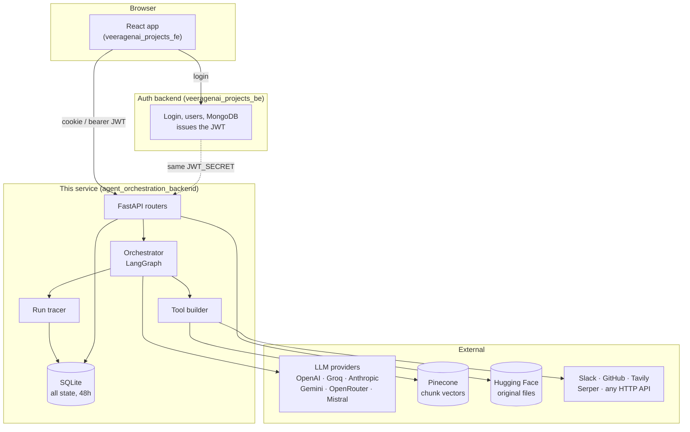

**The key architectural fact:** this service has **no user database**. It validates
a JWT signed by the auth backend with a shared `JWT_SECRET` and trusts the `sub`
claim as the user id. Every table is scoped by that id. There is no signup, no
login, and no MongoDB dependency here.

### Source layout

| Path | Responsibility |
|---|---|
| `main.py` | App assembly, lifespan, CORS, request logging, `/health` |
| `config.py` | Environment settings, database path resolution |
| `auth.py` | JWT verification → `user_id` |
| `database.py` | Schema, connections, the retention sweep |
| `models.py` | Pydantic request bodies |
| `routers/agents.py` | Agents, connections, export/import |
| `routers/tools.py` | Tool CRUD, the built-in catalogue, assignment |
| `routers/execute.py` | Running agents, streaming, traces, metrics, conversations |
| `routers/rag.py` | Document upload, extraction, chunking, indexing |
| `routers/settings.py` | Provider keys, stats |
| `services/orchestrator.py` | Graph building, delegation, orchestration modes |
| `services/tool_builder.py` | Turning stored rows into callable LangChain tools |
| `services/builtin_tools.py` | The built-in tool catalogue and implementations |
| `services/llm_provider.py` | Provider clients, per-user key storage |
| `services/tracing.py` | The callback handler that records every run |
| `rag_embeddings.py` | Google Gemini embeddings |
| `rag_vector_store.py` | Pinecone wrapper |
| `rag_storage.py` | Hugging Face bucket wrapper |

---

## 2. The central flow

This is the single most important sequence in the system. Everything else supports it.

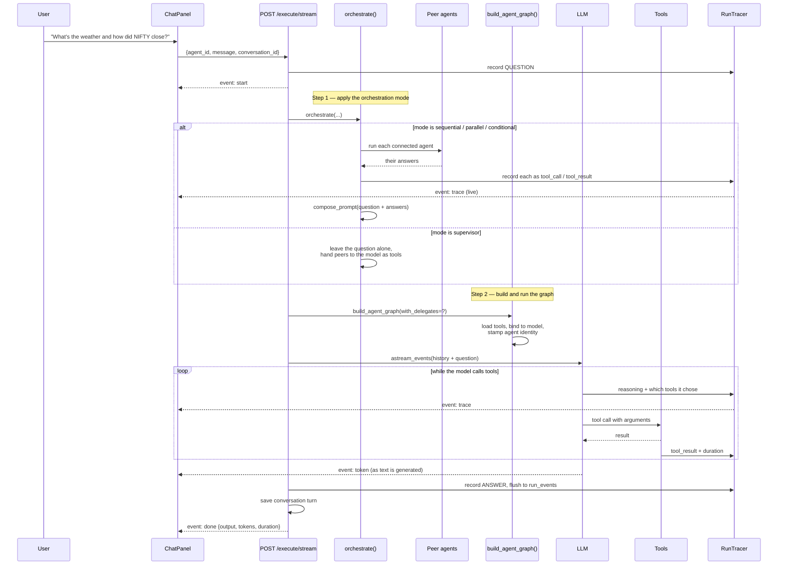

Two distinct phases matter here:

- **Phase 1 — orchestration.** Deterministic. Decided by the agent's
  `orchestration_mode`. Runs *before* the answering model is called.
- **Phase 2 — the agent graph.** A LangGraph loop: model → tools → model → …
  until the model stops asking for tools.

In `supervisor` mode phase 1 does nothing and all the routing happens inside
phase 2, driven by the model. In the other three modes phase 1 does the routing
and phase 2 just writes the final answer.

---

## 3. The data model

Ten tables, all SQLite, all scoped by `user_id`, all deleted after 48 hours.

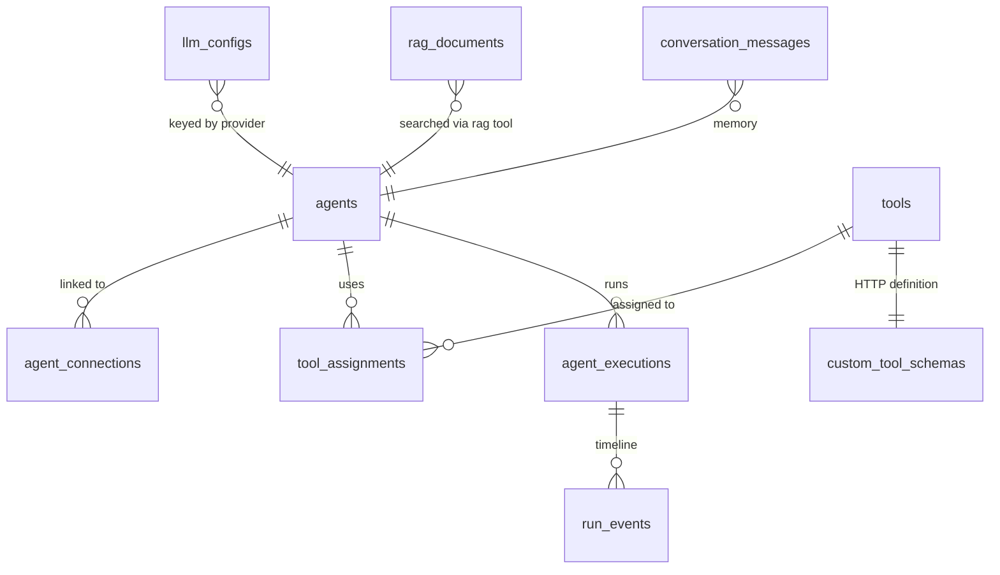

| Table | What it holds | Notes |
|---|---|---|
| `agents` | name, description, system prompt, provider, model, temperature, max_tokens, position, `orchestration_mode` | The node in your graph. `llm_model` is free text so new models work without a deploy. |
| `agent_connections` | source, target, `label`, `condition_expr` | An edge. **Direction is ignored at run time** — see §7. |
| `tools` | name, description, `tool_type`, `is_builtin`, `config` (JSON) | `config` holds the tool's own credentials, e.g. a Tavily key. |
| `custom_tool_schemas` | api_url, method, headers, request_body (JSON Schema), auth_type, auth_config | One per custom tool. `tool_id` is UNIQUE, so saving is an upsert. |
| `tool_assignments` | agent_id, tool_id | Many-to-many. `UNIQUE(agent_id, tool_id)`. |
| `llm_configs` | provider, api_key, base_url | **One key per provider per user**, shared by every agent on that provider. |
| `rag_documents` | filename, type, size, `remote_path`, `embedding_model`, `chunk_count`, status | The vectors live in Pinecone, the file in Hugging Face; this row is the index. |
| `agent_executions` | agent_id, input, output, status, duration_ms, tokens_used | One row per run. |
| `run_events` | seq, event_type, name, agent, depth, content, data, duration_ms | The trace. Ordered by `seq`. |
| `conversation_messages` | conversation_id, role, content | Chat memory, replayed per thread. |

**Schema migrations** are handled inline in `init_db()` with `PRAGMA table_info`
checks, e.g. adding `orchestration_mode` to an existing `agents` table. There is
no migration framework — with a 48-hour data lifetime the cost of a heavier tool
is not justified.

**Connection settings:** `PRAGMA journal_mode=WAL` (concurrent readers during a
write) and `PRAGMA foreign_keys=ON` (cascades actually fire).

---

## 4. Configuration and startup

### `config.py`

A `pydantic-settings` model reading `.env` then `.env.local`. Two details worth
knowing:

```python
@model_validator(mode='before')
def _drop_blank_values(cls, values):
    # Hosting dashboards often define a variable with an empty value;
    # treat that as unset so the default applies.
    return {k: v for k, v in values.items() if v != ''}
```

Without this, a hosting panel that renders `DATA_DIR=` as an empty string would
override a perfectly good default with `''`.

```python
def sqlite_path(self, filename, default_directory):
    if os.getenv('VERCEL'):
        directory = Path(gettempdir()) / 'agent_orchestrator'
    else:
        directory = Path(self.data_dir) if self.data_dir else default_directory
    directory.mkdir(parents=True, exist_ok=True)
    return directory / filename
```

Serverless platforms only allow writes under `/tmp`. This detects the platform
itself rather than making you remember to set `DATA_DIR`.

### `main.py`

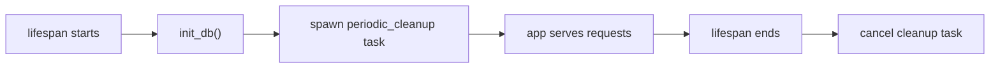

- `periodic_cleanup` sleeps `CLEANUP_INTERVAL_SECONDS` (default 3600) and calls
  `cleanup_expired_data()`, swallowing exceptions so one bad sweep never kills
  the loop.
- An HTTP middleware logs `METHOD path -> status | duration`.
- CORS allows the configured frontend origins **plus** `https://*.vercel.app`
  via `allow_origin_regex`, so preview deployments work without reconfiguration.
- `/health` is the only unauthenticated route.

---

## 5. Authentication

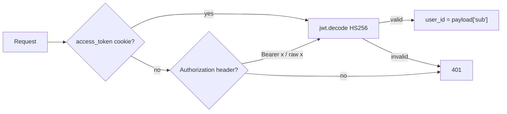

`current_user_id` is a FastAPI dependency; every route except `/health` and
`/tools/builtin` depends on it, and every query filters on the id it returns.
That is the entire authorization model: **you can only ever see rows carrying
your own user id.**

The cookie path matters for deployment. The frontend proxies `/agent-api/*` to
this service through a Vercel/Netlify rewrite, so from the browser's point of
view the call is same-origin and the auth cookie is sent automatically.

---

## 6. Agents and the graph

### `_row_to_agent(row, conn)`

Enriches a raw agent row with what the UI needs:

- `tools` — joined through `tool_assignments`
- `connections` — every edge touching this agent, either direction
- `has_api_key` — whether `llm_configs` has a key for this agent's provider,
  so the UI can warn *before* a run rather than failing at run time

### `GET /agents/graph`

Returns everything the canvas needs in one call: agents (with their tools and
key status) plus the flat connection list. Tools are collected with a single
join and grouped in Python rather than one query per agent.

### Connections

```python
POST   /agents/connections          # {source_agent_id, target_agent_id, label, condition}
PUT    /agents/connections/{id}     # {label, condition}
DELETE /agents/connections/{id}
```

Creation verifies **both** agents belong to the caller in one query
(`COUNT(*) = 2`), which stops anyone linking their agent to a stranger's.

---

## 7. The orchestrator

`services/orchestrator.py` is where the interesting work happens.

### `_connected_agents(user_id, agent_id)` — why direction is ignored

```sql
JOIN agents a ON a.id = CASE WHEN c.source_agent_id = :aid
                             THEN c.target_agent_id ELSE c.source_agent_id END
WHERE (c.source_agent_id = :aid OR c.target_agent_id = :aid)
```

People draw these graphs both ways. Arrows flowing *into* the agent you intend to
chat with ("everything feeds the final answerer") is at least as natural as arrows
flowing out of it. Following only outgoing edges meant the last agent in a chain
had nobody to consult and answered alone — the single most confusing behaviour the
project had.

**A connection now means "these two can talk."** Duplicate links between the same
pair collapse into one tool, preferring whichever carries a label.

### `build_agent_graph(user_id, agent_id, depth, chain, trace, with_delegates)`

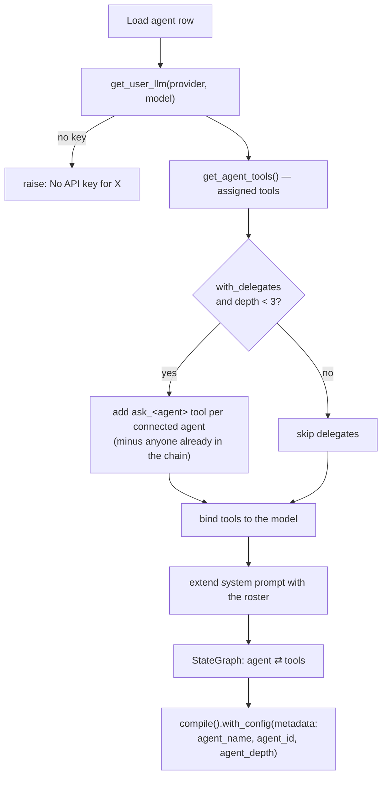

The compiled graph:

```
START → agent → (tools_condition) → tools → agent → … → END
```

`tools_condition` is LangGraph's built-in check: *did the model ask for a tool?*
If yes, run the `ToolNode` and loop back; if no, finish.

The `.with_config({'metadata': …})` stamp at the end is what makes tracing work.
Every model call and tool run beneath this graph inherits that metadata, so the
tracer can say which agent produced each event. A delegated agent compiles its own
graph and overrides the stamp for its own subtree.

### Delegation and its two guards

Each connected agent becomes a tool:

```python
StructuredTool.from_function(
    coroutine=_run,
    name=_tool_name(target['name'], target['id']),   # ask_weather_expert
    description=f"Ask the specialist agent '{name}' … Use it for: {purpose}.",
    args_schema=DelegateInput,                        # {question: str}
)
```

Calling it builds the target's graph and invokes it with just the question — the
delegate does **not** see the parent conversation, which is why the tool
description tells the model to include all needed context.

Two independent guards stop this recursing forever:

| Guard | Mechanism |
|---|---|
| **Depth** | `MAX_DELEGATION_DEPTH = 3`. Past that, no delegate tools are offered at all. |
| **Cycles** | `chain` accumulates every agent already in this delegation path; anyone in it is filtered out of the next agent's options, so A → B → A cannot happen. |

`_tool_name` normalises to `[a-zA-Z0-9_]` because providers reject anything else,
falling back to `ask_agent_<id prefix>` for a name with no usable characters
(an all-emoji name, say).

### `_final_text(result)`

Returns the **last AI message with real text**, not a join of every message.
Joining everything meant replies echoed the user's own question and raw tool
output back at them.

---

## 8. Orchestration modes

Every agent carries an `orchestration_mode`. **In every mode except
`supervisor`, the agent you chat with writes the final answer** — the mode only
decides how its connected agents contribute first. That is what keeps arrow
direction from changing the outcome.

```mermaid
graph TB
    subgraph "supervisor — the model decides"
        S1["You ask agent A"] --> S2["A's model sees<br/>ask_B, ask_C as tools"]
        S2 --> S3["It may call one,<br/>both, or neither"]
        S3 --> S4["A answers"]
    end

    subgraph "sequential — deterministic chain"
        Q1["You ask agent A"] --> Q2["B runs"]
        Q2 --> Q3["C runs, and is shown<br/>what B said"]
        Q3 --> Q4["A composes the answer"]
    end

    subgraph "parallel — fan out"
        P1["You ask agent A"] --> P2["B and C run<br/>at the same time"]
        P2 --> P3["A merges both answers"]
    end

    subgraph "conditional — routed"
        C1["You ask agent A"] --> C2["One classification call:<br/>which conditions match?"]
        C2 --> C3["Only matching agents run,<br/>in sequence"]
        C3 --> C4["A composes the answer"]
    end
```

### `orchestrate(...)` — the entry point

```python
mode = row['orchestration_mode'] or 'supervisor'
if mode not in MODES: mode = 'supervisor'          # unknown value degrades safely
peers = _connected_agents(...) if mode != 'supervisor' else []
if mode == 'supervisor' or not peers:
    return message, True, mode        # question unchanged, delegates enabled
...
return compose_prompt(message, contributions, mode), False, mode
```

Note the return contract: `(question, with_delegates, mode)`. When a mode has
already gathered the peers' answers, `with_delegates=False` stops the same agents
being offered *again* as tools — otherwise the work would be done twice.

An agent with no connections behaves identically in all four modes.

### `gather_contributions(...)`

- **parallel** — `asyncio.gather(...)` over `_ask_peer`, with
  `return_exceptions=True` so one failing agent does not sink the run.
- **sequential / conditional** — a loop that accumulates a transcript and passes it
  to each subsequent agent, so later agents can build on earlier work:

```
{question}

What other agents have established so far:
[Weather]: It is 24°C and sunny.
```

### `_matching_peers(...)` — conditional routing

The condition is a connection's `condition_expr`, falling back to its `label`, so
the single "when should this agent be consulted?" prompt in the UI serves both as
the supervisor's routing hint and as the conditional rule.

Matching is **one** classification call covering every edge, not one per edge:

```
Decide which of these agents are relevant to the question.
Reply with ONLY a JSON array of the matching numbers, e.g. [0,2].

Question: will it rain tomorrow?

Agents:
0. Weather: the question is about weather
1. Finance: the question is about markets
```

Behaviour is deliberately forgiving: surrounding prose is tolerated (the JSON is
extracted with a regex), out-of-range indices are dropped, and an **unparseable
reply falls open** — every conditional agent contributes — so a routing hiccup can
never leave the user with no answer at all. Agents with no condition always run.

Modes apply to the agent you chat with; agents it consults run the ordinary
supervisor way, which bounds how far a deep graph can multiply.

---

## 9. Tools

### The three kinds

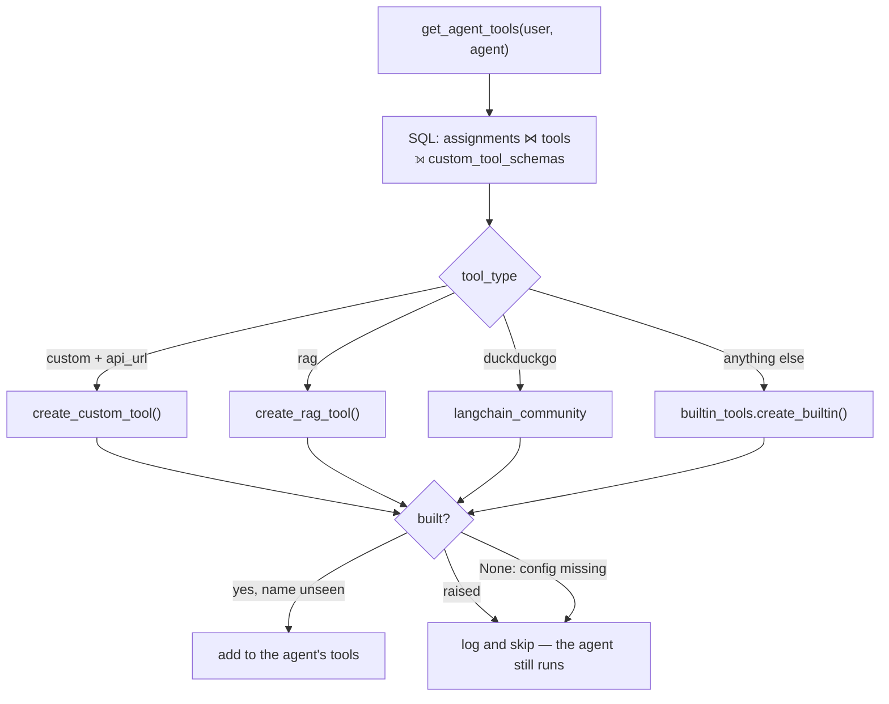

Two protections in that loop:

- **One broken tool must not take the agent down.** Each build is wrapped; a
  failure is logged and skipped.
- **Duplicate resolved names are dropped**, because two identically named tools
  are ambiguous to the model.

### Built-in catalogue (`services/builtin_tools.py`)

Every built-in is a plain REST call made with `aiohttp` — **no provider SDKs**, so
adding a tool never adds a dependency and never risks a deploy.

| Type | Tool name | Needs |
|---|---|---|
| `datetime` | `current_datetime` | — |
| `calculator` | `calculator` | — |
| `web_fetch` | `fetch_web_page` | — |
| `http_request` | `http_request` | — |
| `duckduckgo` | `duckduckgo_search` | — |
| `rag` | `rag_search` | a saved Gemini key |
| `slack` | `slack_post_message` | webhook URL **or** bot token |
| `tavily` | `tavily_search` | API key |
| `google_search` | `google_search` | Serper API key |
| `github` | `github` | token + repo |

The registry is the single source of truth: `GET /tools/builtin` serves it, so the
UI list cannot drift from what actually builds. Each entry declares `requires`,
where `"webhook_url|api_key"` means *either* satisfies it. **A factory whose
required config is missing returns `None` and the tool is simply not given to the
agent** — it never half-works.

The calculator is worth a note. It parses to an AST and walks it with a whitelist
of operators:

```python
if isinstance(node, ast.Constant): ...      # numbers only
if isinstance(node, ast.BinOp) and type(node.op) in _OPERATORS: ...
raise ValueError('Unsupported expression')
```

No name lookup or call node is reachable, so `__import__("os").system(...)` is
rejected as an unsupported expression rather than executed.

### Custom tools

You describe an HTTP endpoint and its fields; the system turns that into a typed
tool the model can call.

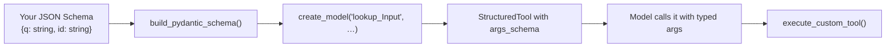

`execute_custom_tool` handles the details that make a tool actually usable:

- **`{placeholder}` substitution** — `https://api.com/users/{id}` is filled from
  the arguments, URL-encoded, and that argument is then *consumed* so it is not
  also sent as a duplicate query parameter.
- **Arguments go where the method expects them** — query string for GET and
  DELETE, JSON body for POST/PUT/PATCH.
- **Auth** — bearer, api_key (custom header name), or basic.
- **Honest results** — a non-JSON response is returned as text rather than being
  reported as an error, and a 4xx/5xx comes back as
  `{"error": "HTTP 404", "body": "…"}` so the model knows it failed.

---

## 10. RAG

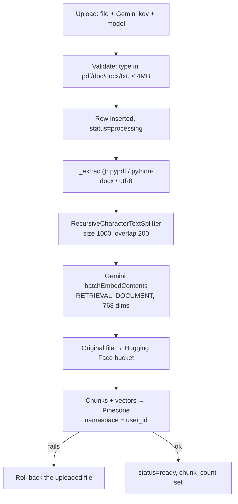

At **query** time the `rag_search` tool embeds the question with
`RETRIEVAL_QUERY` and searches the user's Pinecone namespace.

Two subtleties that are easy to get wrong:

1. **The query must use the same embedding model as the documents.** Vectors from
   different models are not comparable even at the same dimensionality.
   `_user_embedding_model()` looks up the model the user's most recent *ready*
   document actually used, ordered by `created_at DESC, rowid DESC` — the rowid
   tiebreaker matters because `created_at` is only second-granular and two uploads
   in the same second would otherwise pick the older model.
2. **The upload key is not stored.** You supply a Gemini key per upload and it is
   used once. The `rag_search` tool, however, needs a key at query time, and takes
   it from your *saved* `google_genai` key. That is why key management still exists
   in the UI even though keys are normally entered on an agent.

Isolation is by Pinecone namespace (`user_id`) and by a
`agent-orchestrator/users/{user_id}/documents/…` path prefix in the shared bucket.

---

## 11. Streaming

`POST /execute/stream` returns `text/event-stream`. Each frame is
`data: {json}\n\n`.

| `type` | Meaning |
|---|---|
| `start` | Run accepted; carries `execution_id` |
| `token` | A chunk of the reply text |
| `trace` | A step: reasoning, tool call, tool result, error |
| `delegation` | A question sent to a connected agent, or its answer |
| `done` | `output`, `duration_ms`, `tokens`, `mode`, `delegations` |
| `error` | The run failed |

Only the agent you chat with streams tokens. Its model is tagged `primary_agent`
and the filter is load-bearing: delegated agents run their own graphs whose model
events propagate into the same stream and would otherwise interleave into your
reply as gibberish.

### The event-merge loop

Two sources have to be merged into one ordered stream: the LangGraph event
iterator and a queue that tools push into. The pattern used throughout:

```python
getter = asyncio.create_task(queue.get())
while True:
    done, _ = await asyncio.wait({getter, task}, return_when=asyncio.FIRST_COMPLETED)
    if getter in done:
        yield getter.result()
        getter = asyncio.create_task(queue.get())   # a fresh getter each time
        continue
    getter.cancel()          # nothing was taken from the queue, so nothing is lost
    while not queue.empty():
        yield queue.get_nowait()
    await task               # re-raise whatever the run failed with
    break
```

The subtlety: a naive `wait_for(queue.get(), timeout=…)` leaks a pending `get()`
that later consumes — and silently drops — an event. Creating exactly one getter
and cancelling it only when it has *not* completed avoids that.

The orchestration phase runs before the model does, so it gets the same treatment;
otherwise a sequential run of three agents would sit silent and then dump every
event at once.

### Client side

`agentStream()` in `src/lib/agentApi.js` reads the body stream and splits on the
blank-line frame separator, keeping any partial tail buffered. It is tested
against frames split mid-JSON, several frames in one chunk, a split exactly on the
separator, a malformed frame (skipped, stream survives), and a multi-byte
character split across a chunk boundary — hence `decoder.decode(value, {stream: true})`.

Timeouts are split by path: a CRUD call fails fast at 30s, but `/execute` and
`/rag/upload` get five minutes, because a multi-agent run is a chain of LLM calls
and would otherwise abort in the browser while the backend was still working.

---

## 12. Tracing and observability

### Why a callback handler

The alternative — instrumenting the orchestrator by hand — cannot see inside a
delegated agent's graph without threading state through every call. **LangChain
callbacks propagate down automatically**, so a sub-agent's own reasoning and tool
calls land in the same timeline, already in the right order, for free.

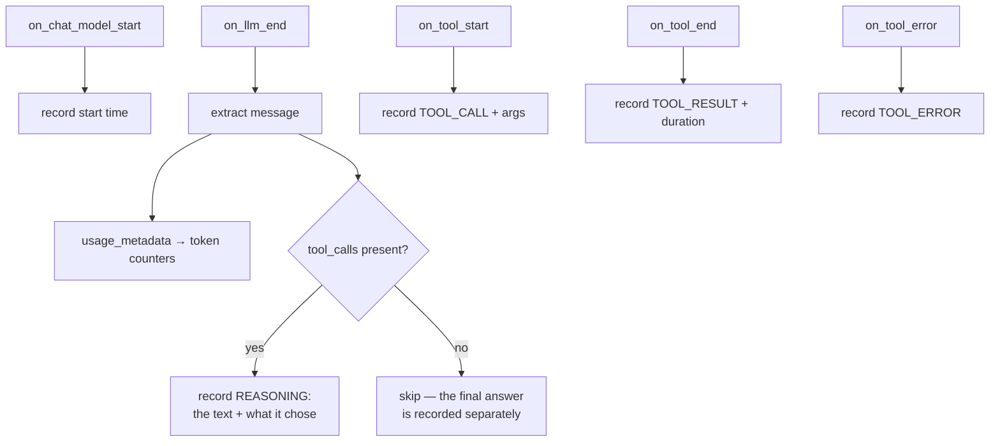

The `reasoning` event is the answer to *"why did it do that?"* — it pairs the
model's own words at the moment of deciding with `chose: [...]`, the exact tools
that decision produced. Text without tool calls is skipped because that is the
final answer, already recorded as `ANSWER`.

Events are buffered in memory and written in **one transaction at the end**: a run
is short, and a single insert keeps `seq` contiguous. When a queue is attached
(the streaming path) each event is *also* pushed as it happens.

A real recorded run:

```
 1 question                              What is today and how many days are left?
 2 reasoning    [Supervisor]             "…so I should ask the time specialist."
                                          → chose ask_time_specialist
 3 tool_call    [Supervisor]  ask_time_specialist   {"question": "What is today?"}
 4    reasoning [Time Specialist]        "I need the current date."
                                          → chose current_datetime
 5    tool_call [Time Specialist]  current_datetime  {}
 6    tool_result [Time Specialist]      {"date": "2026-09-02", …}
 7 tool_result  [Supervisor]  ask_time_specialist   Today is Wednesday.
 8 reasoning    [Supervisor]             → chose calculator
 9 tool_call    [Supervisor]  calculator {"expression": "30-2"}
10 tool_result  [Supervisor]  calculator 28
11 answer                                Today is Wednesday, and that leaves 28 days.
```

Indentation is `depth`; the agent in brackets comes from the graph metadata stamp.

`GET /execute/runs/{id}` returns the run, the timeline, and a computed summary
(steps, tool calls, distinct tools, agents involved, delegations, max depth,
errors). `GET /execute/metrics` aggregates across runs: success rate, average and
p95 duration, total tokens, and per-tool and per-agent breakdowns.

Content is clipped at 4000 characters per event so one oversized tool payload
cannot bloat a trace.

---

## 13. Conversation memory

`conversation_id` on the execute request selects a thread. If present:

1. `load_history()` replays the last `HISTORY_LIMIT` (20) messages, oldest first.
2. The new question is appended.
3. On success, `save_turn()` writes both the question and the answer.

Bounded so a long chat cannot grow the prompt without limit; ordered by
`created_at DESC, rowid DESC` for the same second-granularity reason as RAG.
Threads are scoped per user *and* per conversation, and **a failed run is not
written to memory** — an error should not poison the next turn.

The frontend gives each agent its own thread, so switching agents never shows one
agent the other's history.

---

## 14. Export and import

Because every row is deleted after 48 hours, export is what lets work survive.

`GET /agents/export` returns agents, connections, tools, custom schemas and
assignments, with agents and tools referenced **by index** rather than id so
`POST /agents/import` can recreate them with fresh ids and remap the references.

**Credentials are stripped on export.** `_strip_secrets` walks the structure and
blanks anything keyed `api_key`, `token`, `webhook_url`, `password`, `secret`,
`authorization`, etc. The file is downloaded and often shared, and everything in it
is re-enterable — so the safe default is the right one. The import response says
so, and the UI repeats it.

Import is defensive: a non-list `agents` is a 400, entries without a name are
skipped, self-links are rejected, and out-of-range references are ignored rather
than raising.

---

## 15. Retention

One rule, enforced in one place: **everything older than 48 hours is deleted.**

`cleanup_expired_data()` runs hourly and, crucially, deletes **external** state
before local rows:

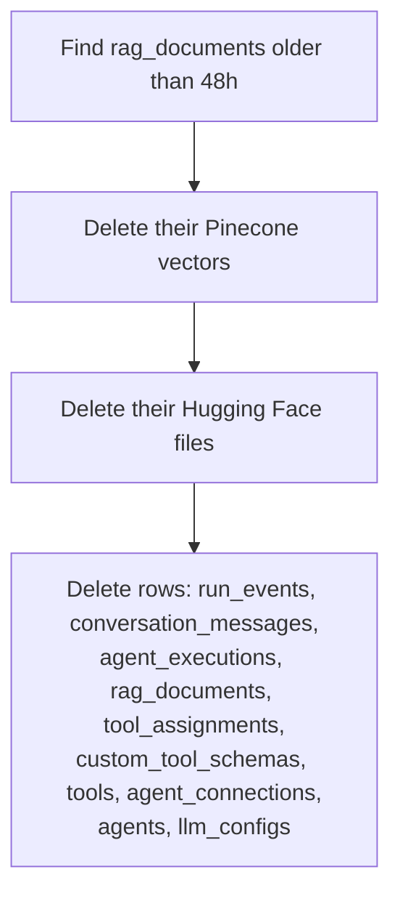

If the SQLite row went first, the `remote_path` and `chunk_count` needed to clean
up Pinecone and Hugging Face would be gone, orphaning data in both. External
deletes are individually wrapped so one failure does not stop the sweep.

**API keys are included in the sweep.** They are stored in plain text in SQLite —
a deliberate trade-off given a 48-hour lifetime and no key-management
infrastructure, and the reason the UI states the deletion promise everywhere.

---

## 16. The frontend

React + Vite, with `@xyflow/react` for the canvas and `zustand` for state.

| File | Responsibility |
|---|---|
| `AgentOrchestration.jsx` | Shell, tab rail, loads the graph once |
| `AgentGraph.jsx` | Canvas, node rendering, connect/label, create dialog, export/import |
| `AgentDetailPanel.jsx` | Agent config: prompt, provider/model, key, mode, tools, "can consult" |
| `ChatPanel.jsx` | Streaming chat, live steps, delegation trace, per-agent threads |
| `ToolManager.jsx` | Built-in catalogue and custom tool builder |
| `RagManager.jsx` | Upload and document list |
| `TracePanel.jsx` | Metrics, tool usage, run list, timeline viewer |
| `SettingsPanel.jsx` | Saved keys, stats, recent runs |
| `store.js` | Shared state: agents, connections, tools, chat, conversation id |
| `providers.js` | Provider list, model suggestions, orchestration mode metadata |
| `lib/agentApi.js` | Fetch wrapper, SSE client, path-aware timeouts |

Two deliberate UI decisions:

- **The model field is free text with suggestions**, not a dropdown. Providers ship
  and retire models constantly; a hardcoded list would mean a new model could not
  be used until someone edited and redeployed the frontend. The backend already
  stored `llm_model` as free text and passes it straight through.
- **The API key is on the agent form**, not only in settings. An agent picks its
  provider at creation time, so requiring a separate trip to settings made it easy
  to create an agent that could not run. Keys still live per provider, so the form
  shows "saved for this provider" or warns "none for this provider", and the graph
  node carries a red **no API key** badge.

---

## 17. Complete API reference

Every route requires a valid JWT except `/health` and `/tools/builtin` (a static
catalogue with nothing user-specific in it).

### Agents

| Method | Path | Purpose |
|---|---|---|
| GET | `/agents` | List with tools, connections, key status |
| GET | `/agents/graph` | Canvas payload: agents + flat connections |
| POST | `/agents` | Create; optional `api_key` saves the provider key |
| GET | `/agents/{id}` | One agent |
| PUT | `/agents/{id}` | Update; `api_key`/`base_url` are routed to the key store |
| DELETE | `/agents/{id}` | Delete with its assignments and connections |
| GET | `/agents/export` | Whole workspace as JSON, credentials stripped |
| POST | `/agents/import` | Recreate a workspace with fresh ids |
| POST | `/agents/connections` | Link two agents |
| PUT | `/agents/connections/{id}` | Set label / condition |
| DELETE | `/agents/connections/{id}` | Unlink |

> Route order matters: `/export` and `/import` are declared **before**
> `/{agent_id}`, or the path parameter would swallow them.

### Execution and observability

| Method | Path | Purpose |
|---|---|---|
| POST | `/execute` | Run and wait for the whole answer |
| POST | `/execute/stream` | Run with SSE: tokens, trace, delegations |
| GET | `/execute/history` | Recent runs with agent names |
| GET | `/execute/runs/{id}` | One run: timeline + summary |
| GET | `/execute/metrics` | Success rate, p95, tokens, per-tool/agent |
| GET | `/execute/conversations/{id}` | Thread messages |
| DELETE | `/execute/conversations/{id}` | Clear a thread's memory |

### Tools, RAG, settings

| Method | Path | Purpose |
|---|---|---|
| GET | `/tools` · `/tools/builtin` | User tools · the built-in catalogue |
| POST | `/tools` · `/tools/{id}/schema` | Create · save an HTTP definition (upsert) |
| PUT/DELETE | `/tools/{id}` | Update · delete |
| POST/DELETE | `/tools/assign` · `/tools/unassign` | Attach/detach a tool to an agent |
| GET/POST/DELETE | `/rag/documents` · `/rag/upload` · `/rag/documents/{id}` | Document lifecycle |
| GET | `/rag/embedding-models` | Supported embedding models |
| GET/POST/DELETE | `/settings/llm-configs` | Provider keys (masked on read) |
| GET | `/settings/providers` · `/settings/stats` | Provider list · counts |

---

## 18. Design decisions

**Why an agent-as-tool supervisor rather than a fixed DAG?**
A DAG is predictable but rigid; agent-as-tool lets the model adapt to the question.
The system offers both: `supervisor` for adaptability, the other three modes when
you need repeatability. Making the mode per-agent means one graph can mix them.

**Why does the agent you chat with always answer?**
Earlier, direction decided who consulted whom, and the result depended on which way
you happened to drag the connection. Making the chatted agent the composer removed
a whole class of confusion — the graph describes *capability*, the mode describes
*procedure*.

**Why SQLite for a multi-agent platform?**
The data lives 48 hours. Postgres would add an operational dependency for state
that is deliberately temporary. WAL mode handles the concurrency this workload has.

**Why REST calls instead of provider SDKs for tools?**
Ten SDKs is ten dependency-resolution risks on every deploy, for what is
fundamentally an HTTP POST. `aiohttp` was already a dependency.

**Why buffer trace events and write once?**
Writing per callback would mean dozens of transactions per run and a sequence that
could interleave. One insert at the end keeps `seq` contiguous and cheap.

**Why does conditional routing fail *open*?**
A routing decision that fails should degrade to "ask everyone" — slower and more
expensive — rather than "ask nobody", which produces an answer with no grounding
and no explanation.

---

## 19. Known limits

Stated plainly, because a system that hides its edges is harder to trust.

- **Orchestration modes apply one level deep.** Agents consulted by your agent run
  the ordinary supervisor way. This bounds how far a deep graph can multiply.
- **No loop/reflection mode.** There is no "iterate until good enough" pattern.
- **Token counts depend on the provider** returning `usage_metadata`. Most do;
  those that do not will read zero.
- **Word-by-word streaming is not guaranteed for every provider.** When it does not
  happen the answer arrives at once — the live trace still shows progress
  throughout, and the `done` event always carries the full output.
- **API keys are stored in plain text** in SQLite. Acceptable only because
  everything is deleted after 48 hours.
- **`is_sub_agent` / `parent_id` only affect the node icon**, and `path_params` /
  `query_params` / `response_body` on custom tools are stored but unused — the
  URL-placeholder substitution covers the practical case.
- **SQLite on a serverless platform is ephemeral.** On a host that only allows
  writes under `/tmp`, data may not survive a cold start or a request landing on a
  different instance. Given the 48-hour policy this is a small extra cost, but on a
  host with a persistent disk it does not apply.
