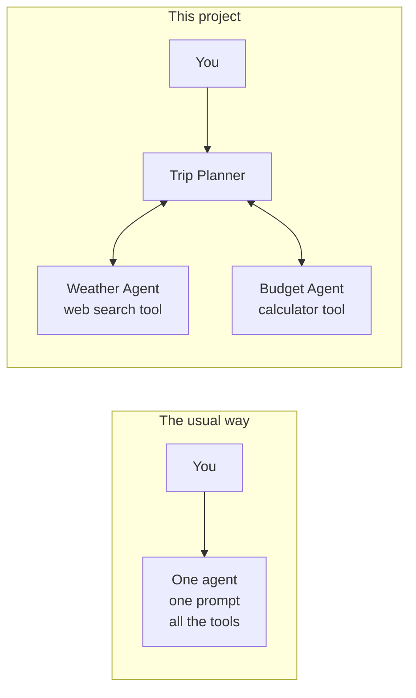
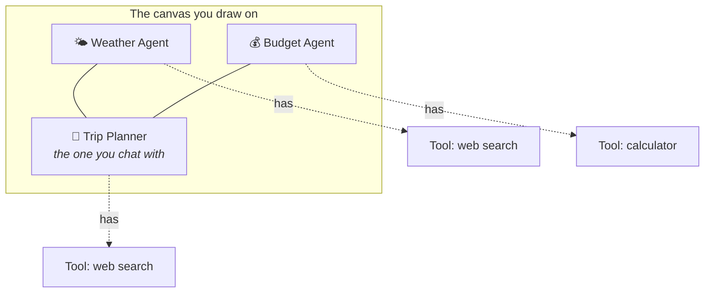
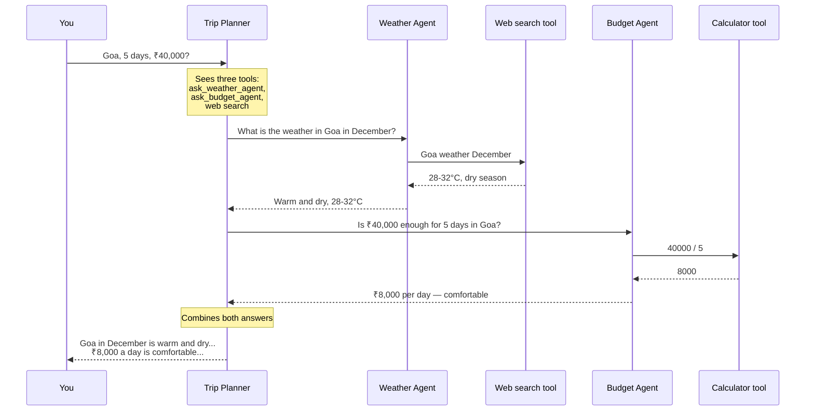
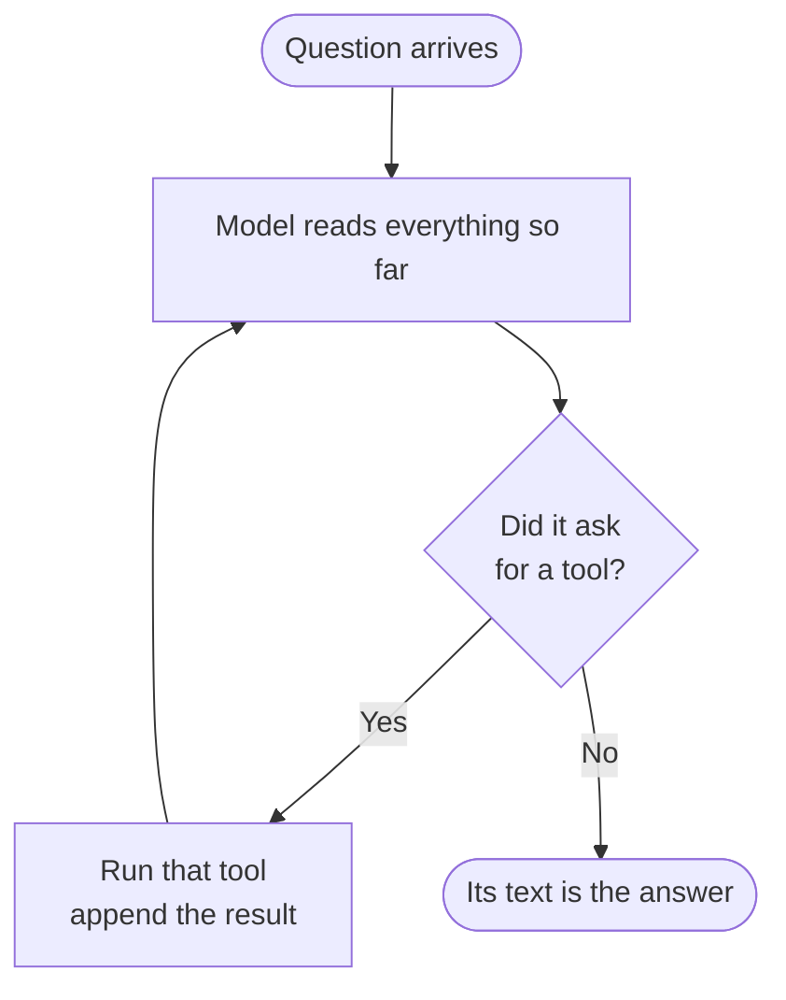
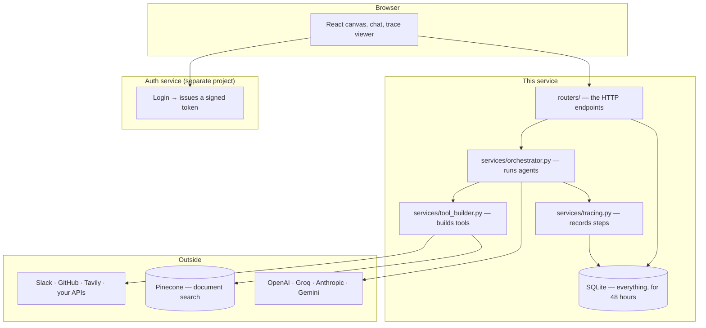
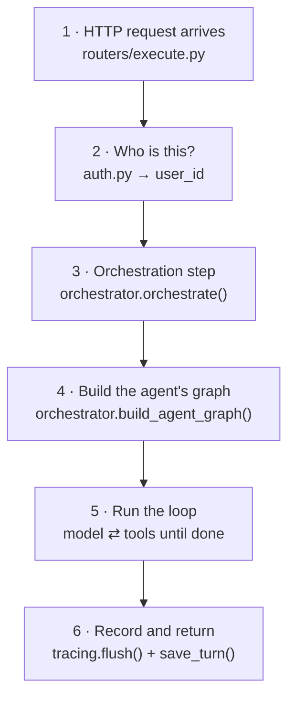
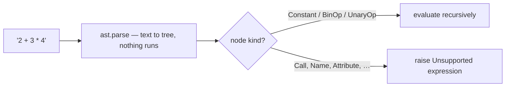
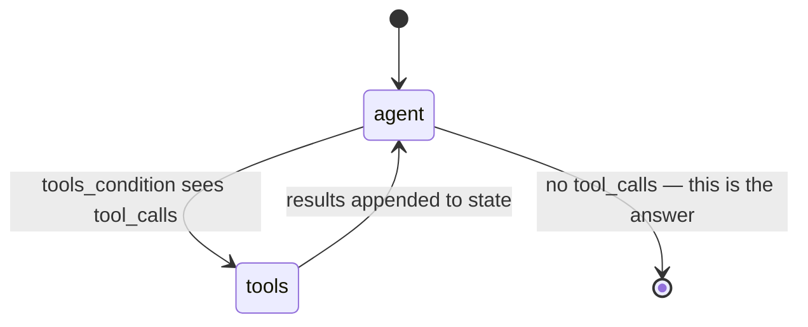
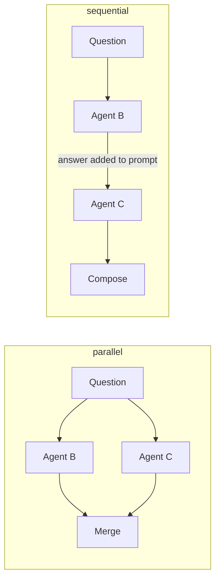

# Understanding This Project, From Zero to Every Line

This document has two parts, and you should read them in order.

**Part 0 — What this project is.** No code at all. What problem it solves, what
you build with it, the six words the whole system is made of, and one complete
example followed from the question you type to the answer that comes back. Start
here even if you wrote some of this code; the rest depends on the vocabulary.

**Part 1 — The code.** Every function: what it receives, what each line does, why
it is written that way, and what would break if it were written differently.

Read both and you should be able to answer any question about this project —
whether someone asks "so what does it actually do?" or "why is that tuple
immutable?"

*(`ARCHITECTURE.md` is the reference companion to this: the data model, the full
API surface, and the design trade-offs, organised for looking things up rather
than reading through.)*

---

## Contents

**Start here if you are new to the project:**

- [0.1 What problem does this solve?](#01-what-problem-does-this-solve)
- [0.2 What you actually build with it](#02-what-you-actually-build-with-it)
- [0.3 The six words you need](#03-the-six-words-you-need)
- [0.4 A complete example, start to finish](#04-a-complete-example-start-to-finish)
- [0.5 Where everything lives](#05-where-everything-lives)

**Then the code:**

1. [How to read a run](#1-how-to-read-a-run)
2. [Startup: what happens before any request](#2-startup)
3. [A request arrives: auth](#3-a-request-arrives-auth)
4. [Layer 1 — `llm_provider.py`: getting a model](#4-llm_providerpy)
5. [Layer 2 — `tool_builder.py`: rows become callable tools](#5-tool_builderpy)
6. [Layer 3 — `builtin_tools.py`: the tools themselves](#6-builtin_toolspy)
7. [Layer 4 — `orchestrator.py`: the heart](#7-orchestratorpy)
8. [Layer 5 — `tracing.py`: recording everything](#8-tracingpy)
9. [The routers](#9-the-routers)
10. [Retention](#10-retention)
11. [Questions you should be able to answer](#11-questions-you-should-be-able-to-answer)

---

# Part 0 — What this project is

*No code in this part. Read it first and the rest will make sense.*

## 0.1 What problem does this solve?

When you use ChatGPT you talk to **one** AI. It has one personality, one set of
instructions, and one set of abilities. That works until your problem has several
different parts.

Say you want to plan a trip. That question really contains three jobs:

- checking the **weather** at the destination,
- working out the **budget**,
- and writing the final **plan** in a way that reads well.

You could write one giant prompt trying to do all three. In practice that agent
becomes mediocre at each: its instructions contradict each other, and giving it a
Slack key so it can post the plan also gives it a Slack key while doing budget
maths.

**This project lets you build a small team instead.** Each agent is separately
configured — its own instructions, its own AI model, its own tools — and you
connect the ones that should work together. Then you talk to one of them, and it
pulls in the others when it needs them.



Two things follow from that design, and they are the reason the project exists:

1. **Each agent stays small and good at one thing.** The Weather Agent's prompt
   is about weather. It has a search tool. It has nothing else.
2. **You can see what happened.** Because the work is split into steps, the system
   records every step — which agent was asked, what it was asked, which tool it
   ran, and what came back. When the answer is wrong you can find the step where
   it went wrong instead of guessing.

## 0.2 What you actually build with it

You work on a canvas, like a whiteboard.



Concretely, you:

1. **Create an agent.** Give it a name, write its instructions ("You are a weather
   specialist. Answer briefly."), pick an AI provider and model, and paste your
   API key.
2. **Give it tools.** A calculator, a web search, a Slack poster, a search over
   your own uploaded documents, or any HTTP API you describe.
3. **Connect agents** by dragging a line between them. A line means *these two are
   allowed to talk*.
4. **Choose how the team works** — does the model decide who to ask, or should
   everyone always be asked in a fixed order? That is the *orchestration mode*.
5. **Chat with one agent** and read the answer, with the full step-by-step record
   of how it got there.

## 0.3 The six words you need

Everything in this codebase is one of these six things.

| Word | Plain meaning | Where it lives |
|---|---|---|
| **Agent** | One configured AI worker: instructions, a model, and some tools. | A row in the `agents` table |
| **Tool** | Something an agent can *do* rather than *say* — search the web, do maths, call an API. | A row in `tools`, attached to agents via `tool_assignments` |
| **Connection** | A line between two agents meaning "these two can talk". | A row in `agent_connections` |
| **Orchestration mode** | The rule for *how* an agent uses its connections: does the AI choose, or does the code decide the order? | A column on `agents` |
| **Run** | One question, from you pressing send to the answer arriving. | A row in `agent_executions` |
| **Trace** | The recorded list of every step inside a run. | Rows in `run_events` |

The one insight that unlocks the whole codebase:

> **Asking another agent is implemented as a tool.**
>
> The AI model already knows how to pick between "use the calculator" and "search
> the web". So instead of inventing a separate mechanism for agent-to-agent
> communication, each connected agent is wrapped up to *look* like a tool, named
> `ask_weather_agent`. The model chooses between tools and agents using one
> mechanism it already understands.

## 0.4 A complete example, start to finish

Let's follow one real question through the whole system. Our setup:

- **Trip Planner** — the agent you chat with. Orchestration mode: `supervisor`.
- **Weather Agent** — connected to Trip Planner. Has a web search tool.
- **Budget Agent** — connected to Trip Planner. Has a calculator tool.

You type: **"I'm going to Goa for 5 days with ₹40,000. What should I expect?"**

### What you see

The answer streams in word by word. Above it, a small expandable line says
*"Consulted 2 agents"*. Opening it shows what each was asked and what it said.

### What actually happens



Step by step, with the responsible code:

| # | What happens | Code |
|---|---|---|
| 1 | Your question arrives with your login token | `routers/execute.py` → `auth.py` |
| 2 | Mode is `supervisor`, so nothing is pre-run; peers become tools | `orchestrate()` |
| 3 | The Trip Planner's toolbox is assembled: its own tools **plus** `ask_weather_agent` and `ask_budget_agent` | `build_agent_graph()` |
| 4 | The model reads the question and asks for `ask_weather_agent` | the `agent` node |
| 5 | That tool builds the Weather Agent's *own* graph and runs it | `_delegate_tool()` |
| 6 | The Weather Agent's model asks for its search tool, reads the result, and answers | the same loop, one level down |
| 7 | Its answer returns to the Trip Planner as a tool result | back in `_delegate_tool()` |
| 8 | Same again for the Budget Agent | — |
| 9 | With both answers in context, the model writes the final reply | the `agent` node, last pass |
| 10 | Every step is written to the trace, and the answer is saved as chat history | `tracing.flush()`, `save_turn()` |

**The important realisation:** steps 4–9 are the *same loop* running at two levels.
The Weather Agent isn't special-cased anywhere. It is an agent, built by the same
function, running the same loop — it just happens to have been started by a tool
call instead of by you.

### The loop, on its own

Every agent, at every level, runs exactly this:



That is the entire agent. Everything else in this codebase is setup around this
loop, or recording what it did.

### What if the mode wasn't `supervisor`?

In `supervisor` the **model** decided to ask both agents. It might have asked one,
or neither. The other three modes take that decision away from the model:

| Mode | What happens with our two connected agents |
|---|---|
| `supervisor` | The model chooses. Might ask both, one, or neither. |
| `sequential` | Weather runs, then Budget runs *and is shown what Weather said*, then Trip Planner writes the answer. Always. |
| `parallel` | Weather and Budget run at the same time, then Trip Planner merges. Always. |
| `conditional` | Only the agents whose condition matches this question run. |

In those three, the connected agents run **before** the model is asked anything,
and their answers are pasted into the question. So the Trip Planner is asked:

```
I'm going to Goa for 5 days with ₹40,000. What should I expect?

--- Answers gathered from your connected agents (sequential orchestration) ---
[Weather Agent]
Warm and dry, 28-32°C.

[Budget Agent]
₹8,000 per day — comfortable.
--- end ---

Using those answers, give the user one clear final response.
```

That is the whole difference between the modes. One rule holds across all of
them: **the agent you chat with always writes the final answer.**

## 0.5 Where everything lives



Two facts that surprise people:

- **This service has no users table and no login.** The separate auth backend
  issues a signed token; this service verifies the signature and trusts the user
  id inside it. Every database query then filters on that id — that *is* the
  security model.
- **Everything is deleted after 48 hours.** Agents, tools, documents, chat
  history, traces, and your API keys. Not a limitation to work around, but a
  design decision the whole system is shaped by — which is why there is an Export
  button.

---

# Part 1 — The code

Now that you know what the pieces are, here is how each one is built.

## 1. How to read a run

Before any individual function, hold this shape in your head. Everything else is
a detail inside one of these five boxes.



Two ideas do the heavy lifting and are worth naming now:

- **A tool is just a function with a description.** Everything an agent can do —
  search the web, call your API, *ask another agent* — is packaged the same way,
  so the model chooses between them with one mechanism.
- **A graph is a loop with a condition.** "Model, then tools, then model again,
  until the model stops asking for tools." That is the whole agent loop.

---

## 2. Startup

### `config.py` — `Settings`

A `pydantic-settings` class. Every field is read from `.env`, and the type
annotation does the validation.

```python
class Settings(BaseSettings):
    jwt_secret: str                 # no default → the app refuses to start without it
    frontend_url: str = "http://localhost:3000"
    cookie_secure: bool = False
    data_dir: str = ""
```

`jwt_secret` has **no default on purpose**. If it is missing, Pydantic raises at
import time and the app never starts. A default would have been far worse: the
service would boot and silently accept nobody's tokens, or worse, everybody's.

#### `_drop_blank_values` — the hosting-panel problem

```python
@model_validator(mode='before')
def _drop_blank_values(cls, values):
    return {k: v for k, v in values.items() if v != ''}
```

`mode='before'` means this runs *before* type validation, on the raw dict.

The problem it solves: hosting dashboards let you define `DATA_DIR` with an empty
value. That arrives as `""`, not "absent" — so `data_dir` becomes `""` instead of
using its default, and `cookie_secure=""` would fail to parse as a bool entirely.
Stripping empty strings makes "defined but blank" mean the same as "not defined".

#### `sqlite_path` — where the database file goes

```python
def sqlite_path(self, filename, default_directory):
    if os.getenv('VERCEL'):
        directory = Path(gettempdir()) / 'agent_orchestrator'
    else:
        directory = Path(self.data_dir) if self.data_dir else default_directory
    directory.mkdir(parents=True, exist_ok=True)
    return directory / filename
```

Serverless platforms make the filesystem read-only *except* `/tmp`. Writing
anywhere else raises at runtime. `VERCEL` is a variable the platform sets itself,
so the code detects its own environment instead of relying on you to remember.
`mkdir(exist_ok=True)` means first boot creates the folder and later boots don't
crash on it already existing.

### `database.py` — `get_db()`

```python
def get_db():
    conn = sqlite3.connect(str(DB_PATH), check_same_thread=False)
    conn.row_factory = sqlite3.Row
    conn.execute("PRAGMA journal_mode=WAL")
    conn.execute("PRAGMA foreign_keys=ON")
    return conn
```

Four decisions in four lines:

| Line | Why |
|---|---|
| `check_same_thread=False` | FastAPI serves requests from a thread pool. SQLite's default refuses a connection used off its creating thread. Safe here because each call gets its **own** connection and closes it. |
| `row_factory = sqlite3.Row` | Rows become mapping-like, so `row['name']` works instead of `row[3]`. Index-based access silently breaks the moment a column is added. |
| `journal_mode=WAL` | Write-Ahead Logging: readers don't block the writer. Default journalling locks the whole database during a write. |
| `foreign_keys=ON` | SQLite **ignores** foreign keys unless you turn them on, per connection. Without this the `ON DELETE CASCADE` clauses in the schema are decoration. |

### `main.py` — lifespan

```python
@asynccontextmanager
async def lifespan(_: FastAPI):
    init_db()
    cleanup_task = asyncio.create_task(periodic_cleanup())
    yield                                   # ← the app serves requests here
    cleanup_task.cancel()
    with contextlib.suppress(asyncio.CancelledError):
        await cleanup_task
```

Everything before `yield` is startup, everything after is shutdown. The
`suppress` matters: cancelling a task makes the next `await` on it raise
`CancelledError`, which is expected here, not an error.

```python
async def periodic_cleanup():
    while True:
        try:
            await asyncio.sleep(settings.cleanup_interval_seconds)
            cleanup_expired_data()
        except asyncio.CancelledError:
            break
        except Exception:
            logger.exception("Cleanup sweep failed")
```

The two `except` clauses are different on purpose. `CancelledError` means "we are
shutting down" → stop the loop. Any *other* exception means one sweep failed →
log it and keep looping, because a single bad sweep must not silently disable
retention forever.

---

## 3. A request arrives: auth

```python
async def current_user_id(request, access_token=Cookie(default=None),
                          authorization=Header(default=None)) -> str:
    token = _extract_token(request, access_token, authorization)
    user_id = decode_access_token(token, settings.jwt_secret)
    if not user_id:
        raise HTTPException(401, "Not authenticated")
    return user_id
```

This is a FastAPI **dependency**. Any route that declares
`user_id: str = Depends(current_user_id)` gets a verified user id, and a route
that doesn't declare it is public. Auth is opt-in per route and visible in the
signature.

```python
def decode_access_token(access_token, jwt_secret):
    try:
        payload = jwt.decode(access_token, jwt_secret, algorithms=["HS256"])
        return payload.get("sub")
    except (jwt.InvalidTokenError, KeyError):
        return None
```

`algorithms=["HS256"]` is pinned deliberately. If you let the library accept
whatever the token's header claims, an attacker sends `alg: none` and every
signature "verifies". Pinning the algorithm is the fix for that whole class of
attack.

**There is no user table in this service.** The token's `sub` claim is the user
id, signed by the auth backend with a shared secret. Authorization is then
purely: *every query filters on that id.*

```python
'SELECT * FROM agents WHERE id=? AND user_id=?'    # ← the second condition is the security
```

---

## 4. `llm_provider.py`

### `get_llm(...)` — one function, six providers

```python
def get_llm(provider, model, api_key, temperature=0.7, max_tokens=4096, base_url=''):
    kw = {'temperature': temperature, 'max_tokens': max_tokens}
    if provider == 'openai':
        return ChatOpenAI(model=model, api_key=api_key, **kw)
    elif provider == 'anthropic':
        return ChatAnthropic(model=model, api_key=api_key, **kw)
    elif provider == 'openrouter':
        return ChatOpenAI(model=model, api_key=api_key,
                          base_url='https://openrouter.ai/api/v1', **kw)
    ...
```

The trick worth noticing: **OpenRouter and Mistral reuse `ChatOpenAI`** with a
different `base_url`. Both speak the OpenAI wire format, so no separate client is
needed. Whatever comes back is a LangChain chat model, and everything downstream
only knows that interface — which is why adding a provider is one `elif`.

### `get_user_llm(...)` — model plus the user's key

```python
def get_user_llm(user_id, provider, model, temperature=0.7, max_tokens=4096):
    row = conn.execute('SELECT api_key, base_url FROM llm_configs '
                       'WHERE user_id=? AND provider=? AND is_active=1 LIMIT 1',
                       (user_id, provider)).fetchone()
    if not row: return None
    return get_llm(provider, model, row['api_key'], temperature, max_tokens, row['base_url'] or '')
```

**Returning `None` rather than raising is a deliberate contract.** The caller
knows the agent's name and can produce a message that helps —
`"No API key for groq. Add it on the agent or in Settings."` — where an exception
thrown from here would only know the provider.

### `save_user_api_key(...)` — one key per provider

```python
existing = conn.execute('SELECT id FROM llm_configs WHERE user_id=? AND provider=?',
                        (user_id, provider)).fetchone()
if existing:
    conn.execute('UPDATE llm_configs SET api_key=?,base_url=?,is_active=1,updated_at=? WHERE id=?', ...)
else:
    conn.execute('INSERT INTO llm_configs (...) VALUES (...)', ...)
```

A manual upsert: look, then update or insert. Keys are stored **per provider, not
per agent**, so ten OpenAI agents share one key and rotating it is one edit.
`created_at` is left alone on update, which matters because retention deletes by
`created_at` — re-saving a key must not extend its life past 48 hours.

---

## 5. `tool_builder.py`

### `build_pydantic_schema(...)` — JSON Schema → a typed model

This function decides what arguments the model is allowed to send to a tool.

```python
JSON_TYPES = {'number': float, 'integer': int, 'boolean': bool,
              'array': list, 'object': dict, 'string': str}

def build_pydantic_schema(schema_dict, schema_name='ToolInput'):
    fields = {}
    for key, val in (schema_dict or {}).get('properties', {}).items():
        if not isinstance(key, str) or not key.isidentifier():
            continue                                    # not usable as a kwarg
        field_type = JSON_TYPES.get(val.get('type', 'string'), str)
        default = val.get('default', ...)
        fields[key] = (field_type, Field(description=...) if default is Ellipsis
                       else Field(default=default, description=...))
    safe_name = re.sub(r'\W|^(?=\d)', '_', schema_name) or 'ToolInput'
    return create_model(safe_name, **fields)
```

Line by line:

- `key.isidentifier()` — the key becomes a Python keyword argument. `"user name"`
  or `"2fa"` cannot be one, so such keys are skipped rather than crashing.
- `val.get('default', ...)` — `...` is `Ellipsis`, used as the "no default"
  sentinel because `None` is itself a valid default. `Field(...)` with Ellipsis
  means **required**.
- `re.sub(r'\W|^(?=\d)', '_', name)` — replaces non-word characters, and the
  lookahead `^(?=\d)` catches a leading digit, since `2Input` is not a valid class
  name.

> ### The bug this line used to contain
>
> ```python
> return type(schema_name, (BaseModel,), fields)      # ← was wrong
> ```
>
> `name: (type, FieldInfo)` is **`create_model`'s** signature. Passing that dict to
> `type()` creates plain class attributes with no annotations, and Pydantic v2
> raises `PydanticUserError: A non-annotated attribute was detected`.
>
> The consequence was much larger than "custom tools are broken". `get_agent_tools`
> had no error handling, so the exception travelled up through graph construction
> and **killed the whole agent**. Attaching one custom tool stopped that agent
> answering at all, with an error pointing at Pydantic internals.

### `execute_custom_tool(...)` — actually calling the endpoint

```python
method = (method or 'POST').upper()
if method not in {'GET', 'POST', 'PUT', 'PATCH', 'DELETE'}:
    return json.dumps({'error': f'Unsupported method: {method}'})
args = dict(request_body or {})
```

`args` is **copied** because the next block mutates it, and mutating the caller's
dict would corrupt the tool's arguments for anything else looking at them.

```python
# Auth
if auth_type == 'bearer':
    req_headers['Authorization'] = f"Bearer {auth_config.get('token', '')}"
elif auth_type == 'api_key':
    req_headers[auth_config.get('header_name', 'X-API-Key')] = auth_config.get('api_key', '')
elif auth_type == 'basic':
    cred = base64.b64encode(f"{user}:{password}".encode()).decode()
    req_headers['Authorization'] = f'Basic {cred}'
```

Basic auth is base64 of `user:password` — encoding, not encryption. It is only
safe over HTTPS, and that is a property of the URL the user configured.

```python
# {placeholder} substitution
url = api_url
for key in list(args):
    token = '{' + key + '}'
    if token in url:
        url = url.replace(token, quote(str(args.pop(key)), safe=''))
```

Three things to notice:

1. `list(args)` snapshots the keys, because `args.pop()` mutates the dict —
   iterating it directly would raise `RuntimeError: dictionary changed size`.
2. `quote(..., safe='')` percent-encodes **everything**, including `/`. A value of
   `a b/c` must not turn into an extra path segment.
3. `args.pop(key)` **consumes** the argument. Without the pop, `id` would be
   substituted into the path *and* sent again as `?id=...`.

```python
if method in {'GET', 'DELETE'}:
    kw['params'] = {k: str(v) for k, v in args.items() if v is not None}
else:
    kw['json'] = args
```

> GET and DELETE have no request body, so their arguments belong in the query
> string. **This line used to not exist**: the old code called `session.get(url)`
> and never passed the arguments at all, so a `get_weather(city)` tool always
> fetched the bare URL. It threw no error — it just answered the wrong question,
> and looked like the model being stupid.

```python
async with session.request(method, url, **kw) as resp:
    body = await resp.text()
    if resp.status >= 400:
        return json.dumps({'error': f'HTTP {resp.status}', 'body': body[:1000]})
    try:
        return json.dumps(json.loads(body), indent=2)
    except ValueError:
        return body[:6000]
```

Read as **text first**, then try to parse. The older `await resp.json()` raised on
any non-JSON response, so an API returning plain text looked broken. And checking
`status >= 400` first means a 404 whose body happens to be JSON is reported as a
failure instead of being handed to the model as if it were data.

Everything is truncated (`[:6000]`) because a tool result goes into the next
prompt, and one huge response would blow the context window.

### `get_agent_tools(...)` — the assembly line

```python
rows = conn.execute('''
    SELECT t.*, cts.api_url, cts.method, cts.headers, cts.request_body, ...
    FROM tools t JOIN tool_assignments ta ON t.id = ta.tool_id
    LEFT JOIN custom_tool_schemas cts ON t.id = cts.tool_id
    WHERE ta.agent_id = ? AND t.user_id = ?
''', (agent_id, user_id)).fetchall()
```

`JOIN` on assignments (a tool must be attached to this agent) but `LEFT JOIN` on
schemas (only custom tools have one; built-ins would otherwise vanish).

```python
for row in rows:
    try:
        tool = create_custom_tool(...) if is_custom else create_builtin_tool(...)
    except Exception:
        logger.exception('Skipping tool %s that failed to build', row['name'])
        continue
    if tool and tool.name not in seen:
        seen.add(tool.name)
        tools.append(tool)
```

Two protections:

- **The `try` is the lesson from the Pydantic bug.** A user-defined tool is
  arbitrary input; it must be able to fail without taking the agent with it.
- **`seen`** drops duplicate resolved names. Two tools called `search` are
  ambiguous to the model, and some providers reject the request outright.

### `_user_embedding_model(...)` — a subtle correctness fix

```python
row = conn.execute('''SELECT embedding_model FROM rag_documents
                      WHERE user_id=? AND status='ready' AND embedding_model != ''
                      ORDER BY created_at DESC, rowid DESC LIMIT 1''', (user_id,)).fetchone()
return (row['embedding_model'] if row else None) or DEFAULT_EMBEDDING_MODEL
```

A query vector is only comparable to document vectors **produced by the same
model**. The upload form lets the user choose, so querying with the default would
silently mismatch whenever they picked the other one — no error, just bad results.

`ORDER BY created_at DESC, rowid DESC` — `created_at` is second-granular, so two
uploads in the same second tie. `rowid` is the insertion order and breaks the tie
correctly. Without it, SQLite may return the *older* row.

---

## 6. `builtin_tools.py`

### The registry pattern

```python
BUILTIN_TOOLS = {
    'slack': {
        'name': 'Slack', 'description': 'Post messages to a Slack channel',
        'config_fields': ['webhook_url', 'api_key', 'channel'],
        'requires': ['webhook_url|api_key'],
        'factory': create_slack_tool,
    },
    ...
}
```

One dict is both the catalogue the UI renders (`GET /tools/builtin` serves it) and
the map of factories the orchestrator calls. **They cannot drift**, which is the
bug this design prevents: previously the UI listed tools whose implementation
returned `None`, so they silently never reached the agent.

`'webhook_url|api_key'` means *either satisfies this requirement* — Slack accepts
a webhook or a bot token.

```python
def create_builtin(tool_type, config):
    entry = BUILTIN_TOOLS.get(tool_type)
    if not entry: return None
    try:
        return entry['factory'](config or {})
    except Exception:
        return None
```

A factory returns `None` when required config is missing. The tool is then simply
not given to the agent — **it never half-works**.

### The calculator, and why it is safe

```python
_OPERATORS = {ast.Add: operator.add, ast.Sub: operator.sub, ast.Mult: operator.mul,
              ast.Div: operator.truediv, ast.Pow: operator.pow, ...}

def _eval_node(node):
    if isinstance(node, ast.Constant):
        if isinstance(node.value, (int, float)):
            return node.value
        raise ValueError('Only numbers are allowed')
    if isinstance(node, ast.BinOp) and type(node.op) in _OPERATORS:
        return _OPERATORS[type(node.op)](_eval_node(node.left), _eval_node(node.right))
    if isinstance(node, ast.UnaryOp) and type(node.op) in _OPERATORS:
        return _OPERATORS[type(node.op)](_eval_node(node.operand))
    raise ValueError('Unsupported expression')
```

`ast.parse(expr, mode='eval')` turns text into a syntax tree **without running
it**. This walker then handles exactly three node kinds: number, binary operation,
unary operation. Anything else hits the final `raise`.

Why that is airtight: `__import__("os").system("...")` parses to a `Call` node
wrapping a `Name` node. Neither is in the whitelist, so it is rejected before
anything executes. `eval()` would have run it. This is a **whitelist**, not a
blacklist — you cannot forget to ban something.



### `_request(...)` — one shared HTTP helper

```python
async def _request(method, url, **kwargs):
    try:
        async with aiohttp.ClientSession(timeout=TIMEOUT) as session:
            async with session.request(method, url, **kwargs) as response:
                body = await response.text()
                if response.status >= 400:
                    return None, f'HTTP {response.status}: {body[:400]}'
                try:    return json.loads(body), None
                except ValueError:  return body, None
    except Exception as error:
        return None, f'Request failed: {error}'
```

Returns a `(data, error)` pair rather than raising, so every tool handles failure
the same way and **a network blip becomes text the model can reason about**
instead of an exception that ends the run.

The datetime tool has one detail worth copying:

```python
timezone_offset_hours: Optional[float] = Field(default=None, ...)
```

It is `Optional` with default `None`, not `0`. If the schema default were `0`, the
model omitting the argument would send `0` and silently override the timezone the
user configured on the tool. `None` means "not specified", so the configured value
survives.

---

## 7. `orchestrator.py`

The heart. Read this section slowly.

### `Trace` — a list that can also stream

```python
class Trace(list):
    def __init__(self, queue=None):
        super().__init__()
        self.queue = queue

    def add(self, step):
        self.append(step)
        if self.queue is not None:
            self.queue.put_nowait({'type': 'delegation', **step})
```

Subclassing `list` means it works everywhere a list does (`list(trace)`,
`len(trace)`). `add()` adds the one extra behaviour: when a queue is attached —
which only the streaming path does — every step is *also* pushed for live
delivery. The non-streaming path passes no queue and the branch is skipped, so one
class serves both paths without an `if streaming:` anywhere else.

### `_tool_name(...)` — names providers will accept

```python
slug = re.sub(r'[^a-zA-Z0-9_]+', '_', (agent_name or '').strip().lower()).strip('_')
return f'ask_{slug}' if slug else f'ask_agent_{agent_id[:8]}'
```

Tool names must match `[a-zA-Z0-9_-]`. `"SQL/DB agent!!"` → `ask_sql_db_agent`.
The outer `.strip('_')` removes leading/trailing underscores left by punctuation
at the edges. The fallback exists because a name of only emoji or only symbols
produces an empty slug, and `ask_` alone is invalid — so the agent id is used.

### `_final_text(...)` — what counts as "the answer"

```python
for message in reversed(result.get('messages', [])):
    if isinstance(message, AIMessage) and isinstance(message.content, str) and message.content.strip():
        return message.content.strip()
for message in reversed(result.get('messages', [])):      # fallback
    if isinstance(message.content, str) and message.content.strip():
        return message.content.strip()
return ''
```

The state holds the **whole transcript**: your question, the model's tool
requests, raw tool output, then the reply. Walking `reversed()` and taking the
last `AIMessage` with real text gets the reply.

> The original code joined *every* message, so answers echoed the user's question
> and raw JSON tool output back at them.

Why `.content.strip()` is checked: when a model asks for a tool, it emits an
`AIMessage` whose `content` is `""` and whose `tool_calls` carry the request. That
empty message must be skipped.

The second loop is a safety net for a model that returns a non-`AIMessage` type.

### `_connected_agents(...)` — direction-free adjacency

```sql
SELECT a.id, a.name, a.description, c.label, c.condition_expr AS condition
FROM agent_connections c
JOIN agents a ON a.id = CASE WHEN c.source_agent_id = :aid
                             THEN c.target_agent_id ELSE c.source_agent_id END
WHERE (c.source_agent_id = :aid OR c.target_agent_id = :aid)
  AND c.user_id = :uid AND a.user_id = :uid AND a.id != :aid
```

The `CASE` is the whole idea: **"join the agent at the *other* end of this
edge"**, whichever end that is. The `WHERE` matches edges pointing either way.

- `a.id != :aid` guards a self-link, which would make an agent its own delegate.
- Both `c.user_id` and `a.user_id` are checked — one alone would let a crafted
  connection reference another user's agent.

```python
def routing_detail(entry):
    return bool(entry.get('condition')) + bool(entry.get('label'))

if existing is None or routing_detail(entry) > routing_detail(existing):
    unique[entry['id']] = entry
```

Two agents can be linked twice. Each must appear as **one** tool, and when the
links differ we keep the one carrying the most routing information.

> **Why direction was removed.** Following only outgoing edges meant an agent with
> arrows pointing *into* it — the natural way to draw "these feed the final
> answerer" — had nobody to consult and answered alone, silently. A connection now
> means "these two can talk"; the cycle guard is what prevents loops.

### `_delegate_tool(...)` — an agent, packaged as a tool

```python
def _delegate_tool(user_id, target, depth, chain, trace):
    name = _tool_name(target['name'], target['id'])
    purpose = target.get('label') or target.get('description') or f"the {target['name']} agent"

    class DelegateInput(BaseModel):
        question: str = Field(description=f"The question to ask {target['name']}. "
                                          f"Include all context it needs - it cannot see this conversation.")

    async def _run(question: str):
        trace.add({'agent': target['name'], 'role': 'request', 'text': question})
        try:
            graph = build_agent_graph(user_id, target['id'], depth + 1, chain + (target['id'],), trace)
            result = await graph.ainvoke({'messages': [HumanMessage(content=question)]})
            answer = _final_text(result) or 'The agent returned no answer.'
        except Exception as error:
            answer = f'{target["name"]} could not answer: {error}'
        trace.add({'agent': target['name'], 'role': 'response', 'text': answer})
        return answer

    return StructuredTool.from_function(coroutine=_run, name=name, args_schema=DelegateInput,
                                        description=f"Ask the specialist agent '{target['name']}' ... {purpose}.")
```

The important details:

- **This is a closure.** `_run` captures `user_id`, `target`, `depth`, `chain` and
  `trace` from the enclosing call. The model only supplies `question`; everything
  needed to route it is baked in at build time and cannot be influenced by the
  model.
- **`build_agent_graph` is called *inside* `_run`, not outside.** The delegate's
  graph is built only if the model actually calls the tool — otherwise offering
  five agents would build five graphs and load five sets of tools on every run.
- **`chain + (target['id'],)`** creates a *new* tuple. Tuples are immutable, so
  each delegation branch gets its own path history and sibling branches cannot
  corrupt each other's.
- **`depth + 1`** is what eventually trips the depth guard.
- **The `except` returns a string.** A delegate failing is information the
  supervisor can use and report, not a reason to abort the whole run.
- **The docstring in `DelegateInput`** tells the model the delegate cannot see the
  conversation — this is what stops it sending `"what about the second one?"` with
  no context.

### `build_agent_graph(...)` — assembling the runnable agent

```python
def build_agent_graph(user_id, agent_id, depth=0, chain=(), trace=None, with_delegates=True):
    agent = conn.execute('SELECT * FROM agents WHERE id=? AND user_id=?', (agent_id, user_id)).fetchone()
    if not agent: raise ValueError(f'Agent {agent_id} not found')
    llm = get_user_llm(user_id, agent['llm_provider'], agent['llm_model'], ...)
    if not llm: raise ValueError(f"No API key for {agent['llm_provider']}. ...")
    tools = get_agent_tools(user_id, agent_id)
```

Note `WHERE id=? AND user_id=?` — the ownership check is part of the load, so
there is no path where an agent is built for the wrong user.

```python
    delegates = []
    if with_delegates and depth < MAX_DELEGATION_DEPTH:
        chain = chain or (agent_id,)
        trace = trace if trace is not None else Trace()
        delegates = [t for t in _connected_agents(user_id, agent_id) if t['id'] not in chain]
        tools = tools + [_delegate_tool(user_id, t, depth, chain, trace) for t in delegates]
```

**The two guards, together in four lines:**

| Guard | Code | Effect |
|---|---|---|
| Depth | `depth < MAX_DELEGATION_DEPTH` | At depth 3 no delegate tools are added at all, so the chain simply ends. |
| Cycle | `if t['id'] not in chain` | Anyone already on this path is removed from the options, so A → B → A cannot form. |

`chain = chain or (agent_id,)` seeds the path with the starting agent on the first
call (`chain` defaults to the empty tuple, which is falsy).

`tools + [...]` builds a **new** list rather than `tools.extend(...)`, so the list
returned by `get_agent_tools` is never mutated.

```python
    llm_with_tools = llm.bind_tools(tools) if tools else llm
    if depth == 0:
        llm_with_tools = llm_with_tools.with_config({'tags': [PRIMARY_TAG]})
```

`bind_tools` returns a *new* model object that knows the tool schemas — it does
not mutate `llm`. The `if tools` guard matters because some providers error on an
empty tool list.

The `depth == 0` tag is **load-bearing for streaming**. Delegated agents run their
own models, whose token events propagate into the same event stream; without a way
to tell them apart, a sub-agent's tokens would interleave into your reply as
gibberish.

```python
    base_prompt = agent['system_prompt'] or 'You are a helpful AI assistant.'
    if delegates:
        roster = '\n'.join(f"- {_tool_name(d['name'], d['id'])}: {d['name']} ..." for d in delegates)
        base_prompt += ('\n\nYou coordinate a team of specialist agents. ...' + roster + ...)
```

The roster is appended only when there are delegates. A model told it coordinates
a team when it has none will apologise for being unable to delegate.

```python
    def agent_node(state):
        resp = llm_with_tools.invoke([SystemMessage(content=base_prompt)] + state['messages'])
        return {'messages': [resp]}
```

This is the entire "thinking" step. The system prompt is **prepended fresh every
time** rather than stored in state, so it stays first even after many tool loops.
Returning `{'messages': [resp]}` appends to state — `MessagesState` uses an
add-reducer, so returning one message adds it rather than replacing the list.

```python
    graph = StateGraph(MessagesState)
    graph.add_node('agent', agent_node)
    if tools:
        graph.add_node('tools', ToolNode(tools))
        graph.add_conditional_edges('agent', tools_condition, {'tools': 'tools', END: END})
        graph.add_edge('tools', 'agent')
    else:
        graph.add_edge('agent', END)
    graph.add_edge(START, 'agent')
```



`tools_condition` is LangGraph's built-in router: it inspects the last message and
returns `'tools'` if it contains `tool_calls`, otherwise `END`. `ToolNode` looks
up each requested tool by name, runs it, and appends a `ToolMessage` per result.
The edge back to `'agent'` is what makes it a **loop** — the model sees the results
and decides whether it needs more.

```python
    return graph.compile().with_config({'metadata': {
        'agent_name': agent['name'], 'agent_id': agent_id, 'agent_depth': depth,
    }})
```

This stamp is how tracing attributes events. Every model call and tool run beneath
this graph inherits the metadata; a delegated agent compiles its own graph and
overrides it for its subtree. **Attribution is free** — no state threading.

### Orchestration modes

```python
MODES = ('supervisor', 'sequential', 'parallel', 'conditional')
```

#### `_ask_peer(...)`

Runs one connected agent and records both sides. Structurally the same as
`_delegate_tool._run`, but called **by the mode** rather than chosen by the model.
It records `TOOL_CALL` / `TOOL_RESULT` so a mode-driven consultation appears in
the timeline identically to a model-chosen one.

#### `_matching_peers(...)` — conditional routing

```python
conditioned = [p for p in peers if (p.get('condition') or p.get('label'))]
unconditional = [p for p in peers if p not in conditioned]
if not conditioned:
    return peers, 'no conditions set - every connected agent contributed'
```

`condition or label` means the single "when should this agent be consulted?"
prompt in the UI serves as both the supervisor's hint and the conditional rule.
Agents with **no** condition always run — no rule means no restriction.

```python
listing = '\n'.join(f"{i}. {p['name']}: {p.get('condition') or p.get('label')}"
                    for i, p in enumerate(conditioned))
prompt = ('Decide which of these agents are relevant to the question. '
          'Reply with ONLY a JSON array of the matching numbers, e.g. [0,2]. ...')
```

Numbering the agents and asking for indices is the trick that makes **one call**
cover every edge. Asking per edge would be N calls and N times the latency.

```python
try:
    reply = await llm.ainvoke([HumanMessage(content=prompt)])
    picked = json.loads(re.search(r'\[.*?\]', text, re.S).group(0))
    chosen = [conditioned[i] for i in picked if isinstance(i, int) and 0 <= i < len(conditioned)]
except Exception as error:
    chosen, note = conditioned, f'condition check failed ({error}); all conditional agents contributed'
```

Three layers of tolerance:

1. `re.search(r'\[.*?\]')` extracts the array even when the model wraps it in
   prose ("Sure! [0, 1]").
2. `isinstance(i, int) and 0 <= i < len(...)` discards hallucinated indices like
   `[9]` instead of raising `IndexError`.
3. The bare `except` **fails open** — every conditional agent contributes. Slower
   and more expensive, but a routing hiccup never leaves the user with no answer.

#### `gather_contributions(...)`

```python
if mode == 'parallel':
    answers = await asyncio.gather(*[
        _ask_peer(user_id, peer, question, 0, chain, trace, tracer) for peer in peers
    ], return_exceptions=True)
```

`asyncio.gather` starts every coroutine concurrently — three agents taking two
seconds each finish in about two seconds, not six. `return_exceptions=True` is
essential: without it, the **first** failure cancels the rest and the whole
gather raises, losing the answers that did succeed.

```python
else:   # sequential / conditional
    transcript = ''
    for peer in peers:
        prompt = question if not transcript else (
            f'{question}\n\nWhat other agents have established so far:\n{transcript}')
        answer = await _ask_peer(user_id, peer, prompt, 0, chain, trace, tracer)
        transcript += f'\n[{peer["name"]}]: {answer}\n'
```

The `await` inside a `for` is what makes it sequential. `transcript` accumulates,
so the second agent sees the first's answer and can build on it. The first agent
gets the bare question — there is nothing to show it yet.



#### `orchestrate(...)` — the dispatcher

```python
mode = (row['orchestration_mode'] or 'supervisor').lower()
if mode not in MODES:
    mode = 'supervisor'
peers = _connected_agents(user_id, agent_id) if mode != 'supervisor' else []
if mode == 'supervisor' or not peers:
    return message, True, mode
...
return compose_prompt(message, contributions, mode), False, mode
```

The return contract is `(question, with_delegates, mode)`:

| Situation | Returns | Meaning |
|---|---|---|
| Supervisor, or no connections | `(message, True, mode)` | Question untouched; peers offered to the model as tools |
| A mode gathered answers | `(composed, False, mode)` | Question now carries their answers; **delegates disabled** |

`with_delegates=False` in the second case prevents the same agents being offered
*again* as tools — otherwise the work would be done twice, once by the mode and
once by the model.

An unknown mode degrades to `supervisor` rather than raising, so a bad value in
the database never bricks an agent.

### `execute_agent(...)` — the non-streaming path

```python
eid = _start_execution(user_id, agent_id, message)     # row written immediately, status='running'
tracer = RunTracer(eid, user_id)
tracer.add(QUESTION, content=message)
try:
    question, with_delegates, mode = await orchestrate(...)
    graph = build_agent_graph(user_id, agent_id, trace=trace, with_delegates=with_delegates)
    history = load_history(user_id, conversation_id)
    result = await graph.ainvoke({'messages': history + [HumanMessage(content=question)]},
                                 config={'callbacks': [tracer]})
    output = _final_text(result)
    tracer.add(ANSWER, content=output, duration_ms=dur)
    tracer.flush()
    _finish_execution(eid, output, dur, tokens=tracer.tokens_in + tracer.tokens_out)
    save_turn(user_id, conversation_id, agent_id, message, output)
```

Order matters throughout:

- The execution row is written **before** the work, so a run that crashes still
  leaves a record instead of disappearing.
- `config={'callbacks': [tracer]}` is the single line that turns tracing on for
  the entire tree, sub-agents included.
- `history + [question]` — history first, new question last.
- `save_turn(..., message, output)` stores the **original** message, not the
  composed prompt. Replaying orchestration scaffolding as chat history would
  confuse the next turn.
- In the `except`, `tracer.flush()` runs too, so a failed run still has a
  timeline — which is exactly when you most want one.

### `stream_agent(...)` — the streaming path

An async generator: every `yield` is one server-sent event.

```python
queue = asyncio.Queue()
trace = Trace(queue)
tracer = RunTracer(eid, user_id, queue)
yield {'type': 'start', 'execution_id': eid}
```

The queue is the shared channel. Tools and the tracer push into it from wherever
they run; the generator drains it.

```python
orchestration = asyncio.create_task(orchestrate(...))
getter = asyncio.create_task(queue.get())
while True:
    done, _ = await asyncio.wait({getter, orchestration}, return_when=asyncio.FIRST_COMPLETED)
    if getter in done:
        yield getter.result()
        getter = asyncio.create_task(queue.get())
        continue
    getter.cancel()
    while not queue.empty():
        yield queue.get_nowait()
    break
```

**Read this carefully — it is the subtlest code in the project.** Two things are
racing: orchestration finishing, and the next event arriving. `asyncio.wait(...,
FIRST_COMPLETED)` waits for either.

- If an event arrived: yield it and create a **fresh** getter for the next one.
- If orchestration finished: cancel the pending getter, drain whatever is left
  synchronously, and exit.

Cancelling is safe *precisely because* the getter had not completed — an
uncompleted `queue.get()` has taken nothing, so nothing is lost.

> **The version this replaced leaked events:**
> ```python
> yield await asyncio.wait_for(asyncio.shield(queue.get()), timeout=0.25)
> ```
> `shield` protects the inner task from cancellation, so on timeout the
> `queue.get()` stayed pending, later consumed an item, and dropped it — because
> nobody held a reference to that task any more.

```python
async def run():
    async for event in graph.astream_events({'messages': history + [HumanMessage(content=question)]},
                                            version='v2', config={'callbacks': [tracer]}):
        if kind == 'on_chat_model_stream' and PRIMARY_TAG in (event.get('tags') or []):
            chunks.append(text)
            queue.put_nowait({'type': 'token', 'text': text})
        elif kind == 'on_chain_end' and event.get('name') == 'LangGraph' and not event.get('parent_ids'):
            final_state = event['data'].get('output') or {}
```

- `HumanMessage(content=question)` — **`question`, not `message`**. In every mode
  except supervisor this carries the gathered answers. *Passing `message` here was
  a real bug: the peers ran, cost tokens, appeared in the trace, and their answers
  were then thrown away.*
- `PRIMARY_TAG in event['tags']` — only the top-level model's tokens are streamed.
- `not event.get('parent_ids')` — nested graphs emit an `on_chain_end` named
  `LangGraph` too; only the root run's output is the real answer.

```python
output = _final_text(final_state) or ''.join(chunks).strip()
```

Belt and braces: use the final state if captured, otherwise reassemble the streamed
tokens. Some providers do not stream token-by-token, in which case `chunks` is
empty and `final_state` carries the answer — and vice versa.

---

## 8. `tracing.py`

### Why a callback handler

The alternative is instrumenting the orchestrator by hand — but a delegated agent
runs *its own graph*, so you would have to thread trace state through every call.
LangChain callbacks **propagate down automatically**, so one handler attached at
the top captures sub-agents too, in order, for free.

```python
class RunTracer(AsyncCallbackHandler):
    def __init__(self, execution_id, user_id, queue=None):
        self.events = []
        self._seq = 0
        self._started = {}      # run_id -> (start time, tool name, metadata)
        self.tokens_in = 0
        self.tokens_out = 0
```

`_started` keyed by `run_id` is how durations work: LangChain gives each call a
unique id, present in both the start and end callback, so start times can be
matched to their end even with several tools running concurrently.

### `add(...)`

```python
def add(self, event_type, *, name='', content='', data=None, duration_ms=0, agent=None, depth=0):
    self._seq += 1
    event = {'seq': self._seq, 'event_type': event_type, ..., 'content': _clip(content)}
    self.events.append(event)
    if self.queue is not None:
        self.queue.put_nowait({'type': 'trace', **event})
    return event
```

`_seq` is a monotonic counter, which is what preserves order — timestamps at
millisecond resolution can tie. Everything after `event_type` is keyword-only
(the `*`), so a call site cannot silently pass content into the `name` slot.

### `on_llm_end(...)` — where "why" is captured

```python
usage = getattr(message, 'usage_metadata', None) or {}
self.tokens_in += usage.get('input_tokens', 0) or 0

text = getattr(message, 'content', '')
tool_calls = getattr(message, 'tool_calls', None) or []

if text.strip() and tool_calls:
    self.add(REASONING, content=text, data={'chose': [c.get('name') for c in tool_calls], ...})
elif tool_calls:
    self.add(REASONING, content='', data={'chose': [...], 'no_text': True, ...})
```

This is the most valuable event in the system: it pairs **what the model said at
the moment of deciding** with **the tools that decision produced**.

The `if/elif` is deliberate. Text *with* tool calls is reasoning. Text *without*
tool calls is the final answer, recorded separately as `ANSWER` — recording it
here too would duplicate it. Tool calls with no text still record the choice.

`getattr(..., None) or {}` appears throughout because providers differ: some omit
`usage_metadata` entirely, so token counts read zero rather than crashing.

### `flush()` — one write, not dozens

```python
def flush(self):
    rows = [(str(uuid.uuid4()), self.execution_id, ..., e['seq'], ...) for e in self.events]
    conn.executemany('INSERT INTO run_events (...) VALUES (?,?,?,?,?,?,?,?,?,?,?,?,?)', rows)
    conn.commit(); conn.close()
    self.events = []
```

Buffering in memory and writing once keeps `seq` contiguous and costs one
transaction instead of dozens per run. `self.events = []` after the write makes a
second `flush()` a no-op — which matters because the error path may call it after
the success path already did.

`_clip()` caps each event at 4000 characters so one oversized tool payload cannot
bloat a trace.

---

## 9. The routers

### The pattern every route follows

```python
@router.put('/{agent_id}')
async def update_agent(agent_id: str, agent: AgentUpdate, user_id: str = Depends(current_user_id)):
    existing = conn.execute('SELECT llm_provider FROM agents WHERE id=? AND user_id=?',
                            (agent_id, user_id)).fetchone()
    if not existing:
        conn.close(); raise HTTPException(404, 'Agent not found')
```

Note it returns **404, not 403**, for another user's agent. Saying "forbidden"
would confirm the id exists — 404 reveals nothing.

```python
    updates = {k: v for k, v in agent.model_dump().items() if v is not None}
    api_key = updates.pop('api_key', None)
    base_url = updates.pop('base_url', None)
    if api_key:
        save_user_api_key(user_id, updates.get('llm_provider') or existing['llm_provider'], api_key, base_url or '')
```

`api_key` is a **credential, not a column**. It must be popped out before the SET
clause is built or the SQL would reference a non-existent `agents.api_key`. It is
then saved against whichever provider the agent ends up on — the new one if the
provider is being changed in the same request, otherwise the existing one.

```python
    sc = ', '.join(f'{k}=?' for k in updates)
    conn.execute(f'UPDATE agents SET {sc} WHERE id=?', list(updates.values()) + [agent_id])
```

An f-string in SQL is normally an injection risk. It is safe **here** because the
keys come from `AgentUpdate`'s fields — a fixed set defined in code — not from
user input. The *values* still go through `?` placeholders.

### Route ordering

```python
@router.get('/export')       # ← must be declared BEFORE /{agent_id}
@router.get('/{agent_id}')
```

FastAPI matches in declaration order. Declared the other way round,
`GET /agents/export` would match `/{agent_id}` with `agent_id="export"` and return
404.

### `_strip_secrets(...)` — recursive redaction

```python
SECRET_KEYS = {'api_key', 'token', 'webhook_url', 'password', 'secret', 'authorization', ...}

def _strip_secrets(value):
    if isinstance(value, dict):
        return {k: ('' if k.lower() in SECRET_KEYS else _strip_secrets(v)) for k, v in value.items()}
    if isinstance(value, list):
        return [_strip_secrets(v) for v in value]
    return value
```

Recursion is required because credentials hide at any depth — a custom tool's
`auth_config.token` is two levels down. Blanking rather than deleting keeps the
shape intact, so an import knows the field exists and needs refilling.

### Import: defensive by default

```python
for entry in agents:
    if not isinstance(entry, dict) or not entry.get('name'):
        continue                                   # skip junk, don't crash

def _ref(ids, index):
    return ids[index] if isinstance(index, int) and 0 <= index < len(ids) else None
```

The payload is a file a user edited. Every field is validated or skipped;
`_ref` turns an out-of-range index into `None` instead of an `IndexError`.

---

## 10. Retention

```python
expiring = conn.execute("SELECT id, user_id, chunk_count, remote_path, status FROM rag_documents "
                        "WHERE created_at < datetime('now', '-48 hours')").fetchall()

for doc in expiring:                       # external state FIRST
    if doc['status'] == 'ready':
        try: rag_vector_store.delete_document(...)
        except Exception: pass
        try: rag_storage.delete(doc['remote_path'])
        except Exception: pass

conn.execute("DELETE FROM run_events WHERE created_at < datetime('now','-48 hours')")
...                                        # then the rows
```

**The ordering is the whole point.** The SQLite row holds `remote_path` and
`chunk_count` — the coordinates needed to delete from Pinecone and Hugging Face.
Delete the row first and that information is gone, orphaning data in two external
systems permanently and invisibly.

Each external delete is individually wrapped so one unreachable service does not
stop the sweep.

---

## 11. Questions you should be able to answer

Use these to check yourself.

**Explaining the project to someone new**

| Question | The answer, in one line |
|---|---|
| What is this project? | A canvas where you build a team of AI agents, connect them, and chat with one — it consults the others and shows you every step it took — §0.1 |
| Why not just use one AI? | One prompt trying to do several jobs does each poorly, and you cannot see which part went wrong — §0.1 |
| What is an "agent" here, concretely? | A database row: a name, instructions, a provider and model, and a list of attached tools — §0.3 |
| What does connecting two agents do? | It makes each available to the other as a tool called `ask_<name>` — §0.3 |
| What does an agent actually do when asked something? | It loops: model reads everything, asks for a tool, tool runs, repeat — until it asks for no tool, and that text is the answer — §0.4 |
| What is an orchestration mode? | Whether the AI decides which connected agents to consult, or the code runs them in a fixed way — §0.4 |
| Who writes the final answer? | Always the agent you chatted with, in every mode — §0.4 |
| Where is the login and user database? | In a separate service. This one verifies a signed token and filters every query by the user id inside it — §0.5, §3 |

**Explaining the code**

| Question | Where the answer is |
|---|---|
| How does an agent decide to use a tool? | The model emits `tool_calls`; `tools_condition` routes to `ToolNode`; the loop returns to `agent` — §7 |
| How can an agent call another agent? | Each connected agent is wrapped as an `ask_<name>` tool by `_delegate_tool` — §7 |
| What stops infinite delegation? | `MAX_DELEGATION_DEPTH` and the `chain` tuple, checked together in `build_agent_graph` — §7 |
| Why doesn't arrow direction matter? | `_connected_agents` joins the agent at the *other* end of the edge whichever way it points — §7 |
| How is the trace attributed to the right agent? | Each compiled graph is stamped with metadata; callbacks read it — §7, §8 |
| Why one classification call for conditional routing? | Agents are numbered and the model returns indices — §7 |
| Why does the calculator not allow code execution? | The AST walker whitelists three node types; `Call` and `Name` are unreachable — §6 |
| Where do API keys live and when are they deleted? | `llm_configs`, one row per provider, removed by the 48-hour sweep — §4, §10 |
| Why must external stores be cleaned before SQLite rows? | The row holds the coordinates for both — §10 |
| What was the create_model bug and why was it severe? | Wrong signature for `type()`; no error isolation meant it killed the whole agent — §5 |
| Why does streaming tag the top-level model? | Sub-agents' tokens propagate into the same stream and would interleave — §7 |
| What breaks if `foreign_keys=ON` is removed? | Every `ON DELETE CASCADE` silently stops working — §2 |

### The five sentences that summarise the system

1. A **JWT** identifies the user, and every query filters on that id.
2. An **agent** is a database row: prompt, provider, model, plus attached tools.
3. A **graph** is a loop — model, tools, model — that ends when the model stops
   asking for tools.
4. A **connection** makes another agent available as a tool, and the
   **orchestration mode** decides whether the model chooses, or the code does.
5. A **callback** records every step, and a sweep deletes everything after 48
   hours.
